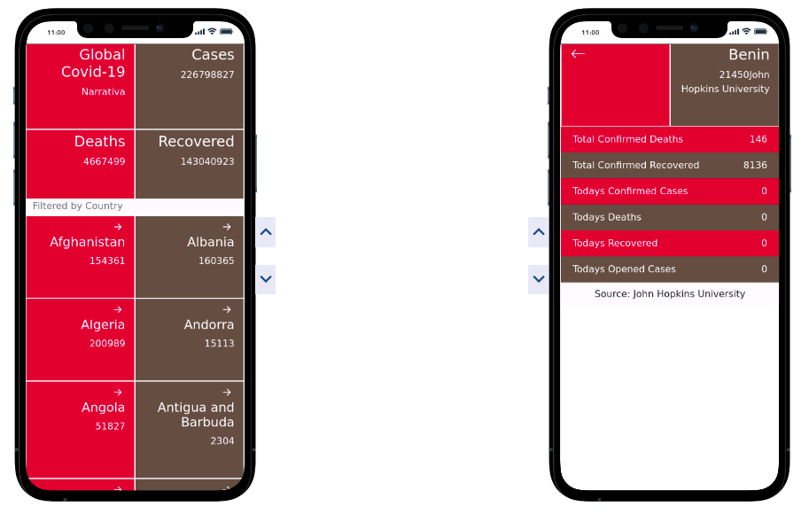

# Covid-19 React Capstone Project.

> An API-based Mobile (View) Application Built With React to Display Global Covid-19 Statistics

This app loads a global covid-19 data that can be filtered by country.

In this project, I have implemented the following:

- Used React components.
- Used React props.
- Used React Router.
- Connected React and Redux.
- Handled events in a React app.
- Wrote integration tests with a React testing library.
- Used styles in a React app.
- Used React life cycle methods.
- Applied React best practices and language style guides in code.
- Used store, actions and reducers in React.

## Built With

- HTML/CSS.
- React.
- Redux.
- Bootstrap.
- Javascript.
- Jest.

## Live Demo

Click [here]() to preview Live App.

## Getting Started

To get a local copy up and running follow these simple example steps.

### Prerequisites

 - Node >= 10.16.
 - npm >= 5.6.

### Setup

  - run `git clone https://github.com/francisuloko/covid-19-capstone-project.git` to clone the project.

### Install

  - run 'npm install'.

### Usage

  - open th project directory and you will see all the project files.

### Run tests

  - run 'npm run test'.

### Deployment

 - run 'npm start' to run the server.

## Authors

👤 **Francis Uloko**
- [GitHub](https://github.com/francisuloko).
- [Twitter](https://twitter.com/francisuloko).
- [LinkedIn](https://linkedin.com/in/francisuloko).

## 🤝 Contributing

Contributions, issues, and feature requests are welcome!

Feel free to check the [issues page](https://github.com/francisuloko/covid-19-capstone-project/issues).

## Show your support

Give a ⭐️ if you like this project!

## Acknowledgments

- Microverse.
- [Narrative API](https://covid19tracking.narrativa.com/index_en.html).
- [Nelson Sakwa on Behance.](https://www.behance.net/sakwadesignstudio) for Original Desing.

## 📝 License

This project is [MIT](./MIT.md) licensed.
